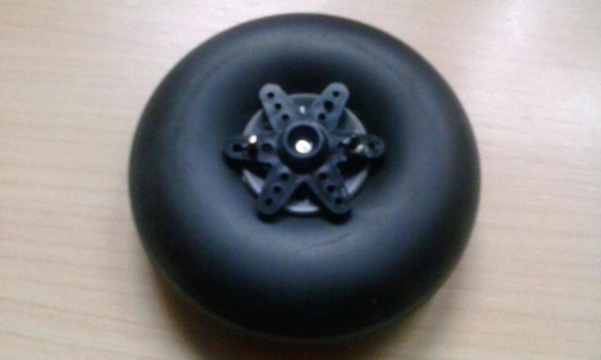

% Robot siguelíneas y resuelve-laberintos
%
% 2015-04-20

Todos los años, la asociación de estudiantes de la ETSII: Reset, organiza
una competición de robótica para toda la UPM. Preparan diferentes
categorias, en cada edición distintas, pero las más típicas son las de sumo
(robot vs robot hasta que uno muera), y la <em>classic</em> (siguelíneas y
laberinto), pensada para los más novatos.

Porque es un tema interesante, me inscribí a la competición para novatos junto
a dos amigos. De electrónica por
entonces no habíamos dado nada, pero era apuntarse entonces o nunca, luego
en cuarto estaríamos más ocupados con el proyecto, exámenes, prácticas o lo que
fuera. Había que dejar de poner excusas y lanzarse a la piscina.

## **Índice**
* [Objetivo y medio](#objetivo)
* [El cacho de madera con ruedas](#El cacho de madera con ruedas)
* [Funcionamiento](#Funcionamiento)
* [La competición](#La competición)

## **Objetivos y medios**

Para participar en la categoría classic debes de hacerte un robot
que sea capaz de seguir una línea negra, y luego poder salir de un
laberinto. Cuanto más rápido mejor, por supuesto.

Y para conseguirlo se te da bastante libertad. Tanto
los medios de propulsión, forma del robot, tipos de sensores, precio, etc.
todos son libres de elegirlos a tu gusto, mientras que no hayas
comprado ningún kit prefabricado, superes los 3 kg de peso máximo,
o uses motores de combustión (estaría muy chulo), pocas más normas hay.

Y para que no te arruines por el camino, la misma asociación te
presta:

* Un Arduino Uno
* Un soldador de estaño
* Un polímetro
* Una placa de prototipado
* Cables, botones, leds, y cosillas sueltas

De lujo. Y participar es gratis!

## **El cacho de madera con ruedas**

Teníamos hasta justo después de semana santa para
traducir la idea vaga y fantasiosa de un terminator que
lanzase rayos, en algo que se moviese y funcionase.

Como digo, entonces no habíamos cursado aún ninguna asignatura de
electrónica, pero inquietaba más que la placa de arduino se programase
en C, porque hasta la fecha solo habíamos programado en Matlab
(ni siquera demasiado).
Así que de la ilusión pasamos a la incertidumbre y luego al miedo.

Por suerte, la asociación de Reset
organizaba unos talleres.
Creo que fueron como unos 4 en total, y en ellos nos explicaban
cómo hacer determinadas cosas: en uno nos presentaban el material,
en otro cómo mover los servos, otro de soldar con estaño, y el último
era de reguladores PID.
No es que nos hicieran todo el trabajo, pero sí que se iniciaba uno
con el tema. Junto a toda la información infinita de internet, parecía
que al final iba a salir un robot digno.

A finales de diciembre, que ya se acababan las clases y los talleres,
teníamos ya la idea de qué teníamos que comprar como mínimo. Necesitaríamos
un par de sensores de proximidad, un par de motorcillos, un sensor
de luminosidad (para detectar la posición respecto de la línea negra), una
batería, unas ruedas... Pero bueno, ya lo veríamos más detenidamente en
navidades.

Volvemos de los exámenes de enero, y el proyecto está muy abandonado.
Ninguno hemos encontrado tiempo para investigar mucho acerca del robot, pero
lo que parece claro es que va a salir por algo más de 100&euro;.

Se propone dejarlo para el año que viene, para vérselo más detenidamente,
porque ya no podíamos pedir a ninguna página china (en teoría más baratas)
y tener lo necesario antes de la competición, porque tampoco teníamos
ningún diseño CAD para hacer
el chasis con impresora 3D (y luego habría una larga lista de espera para
imprimir)... Aparecen de pronto muchos
inconvenientes, y no todo el mundo está dispuesto a hacerlo al final, o
simplemente no pueden dedicarle tiempo.
Así que, sin tampoco anunciarlo, se abandona el proyecto.

Iba a ser una decepción demasiado grande dejarlo en nada, así que ya por
mi cuenta intento hacerme una versión <b>low-cost</b> del robot. Con especificaciones
de alta gama:

* El chasis será de madera
* Los motores serán de dos servos mutilados (sin los topes)
* La batería de litio se cambia por pilas alcalinas
* El tercer apoyo consiste en una chapa de cerveza incrustada en la madera (tendría que haber sido una rueda loca, pero estaban muy caras xD)
* Las ruedas (unas que tenía de juguete), se unen a las cabezas de los servos, atravesándolas con unas varillas de acero y unos tornillos.

La inversión se reduce a unos 40&euro; (aún había que comprar
los sensores).

## **Funcionamiento**

El morro del robot tiene por debajo un banda de sensores infrarrojos.
Emiten luz y en función de cuánta se le refleje dará un valor mayor o
menor de tensión, que después leerá el arduino. De esta forma puede averigurarse
la posición relativa de la línea respecto de la banda de sensores
(mientras la línea esté dentro de la banda).

Definiendo
la variable error como la distancia de la línea al centro
de la banda, se podrá intentar corregir el desvio con un controlador.
En mi caso usé un PID, y fui ajustándolo manualmente. Primero probaba con
unos valores de los parámetros, veía como tomaba el robot la curva,
para cambiar de nuevo los valores intentando corregir el comportamiento... y así
pude estar quizás unas 3 horas hasta que dejaba de salirse.

Respecto a cómo consigue el robot encontrar la salida en un laberinto,
al principio a mi me parecía que iba a ser una tarea muy compleja, difícil
, y que nos llevaría pensar. Resulta que hay un algoritmo para salir
siempre de un laberinto que es extremadamente simple.

_Camina pegado a la misma pared_

No importa lo complejo que sea un laberinto, si siempre vas pegado a la
misma pared, siempre encontraras la salida. En inglés el algoritmo
se conoce como
<em>[wall follower](https://en.wikipedia.org/wiki/Maze_solving_algorithm)
wall follower.</em>

Y para comprobar que mantiene una distancia prudencial
con la misma pared o no se da de frente contra nada, el robot
lleva pegado un sensor de proximidad en uno de sus lados, y otro en
el frontal.

## **La competición**
Hubo gente que se lo curro un montón. Había equipos con su robot
hecho con impresora 3D muy bonitos. Otros eran auténticas balas
haciendo el trazado de línea negra.

Y entonces en la competición, estando todo el mundo con sus robots
llegados del futuro,
aparezco yo con un trozo de madera entre las manos. Me habría gustado
ir con alguien para reirme, pero estando yo solo en el equipo, tampoco
era una situación para estar yo ahí a carcajada limpia. Así que más bien
sentí vergüenza, viendo como mi trozo de madera tardaba dos minutos de reloj
en hacerse el circuito a su paso. Ahora que ya ha pasado sí me río.

Pero me llevo la experiencia de haber participado, la satisfacción de haber sacado algo adelante (fui el único de mi grado en presentar algo para la competición), y sobre todo la camiseta.
