% PFG: Simulación de las propiedades de un refractario libre de carbono
%
% 2017-04-24

_[Descarga el pdf con el PFG completo.](/docs/pfg.pdf)_

---

Así se tituló mi proyecto de fin de grado. Lo solicité a través de
la web de la escuela, donde algunos profesores suben propuestas de trabajos
para los estudiantes, y se me concedió en febrero, empezando el
segundo semestre del último curso del grado. Finalmente lo presenté
en septiembre.

En un principio tenía la intención de proponer yo mismo un
tema para el proyecto, pero:

* Estimar el tiempo que te puede llevar una tarea es difícil, especialmente
si no tienes experiencia haciendo nada parecido, o tan amplio.

* Puede que tengas muy clara tu idea, pero entonces tienes que conseguir
que algún profesor esté dispuesto a hacerte de tutor. Si no encuentras a
nadie libre, relacionado con la materia, a lo mejor te toca cambiar de idea.

Temía especialmente que se me diera el segundo caso. En cuarto eramos
una clase de más de 100 personas, todos buscando proyecto, todos con los
mismos profesores, y ni siquiera parecía que fuésemos problema de la
escuela de industriales. Viniendo de minas (de los dos primeros cursos del grado),
algunos nos proponían ir a buscar allí. Ellos ya estaban saturados.

La situación para encontrar un proyecto estaba tensa, así
que lo mejor que me pudo pasar fue encontrar un tema colgado en la web.
Joaquín Ordieres, el director del departamento de dirección de proyectos y
estadística, buscaba a alguien para simular las propiedades de un refractario
libre de carbono. Que no es que fuese un título que me ganase desde el
minuto 0, pero leyendo un poco más a fondo la descripción, me convenció.
Tenía simulación numérica (elementos discretos), me pedía utilizar linux,
preparar scripts... perfecto para abandonar el papel y el boli, y
hacer un poco de number-crunching <i class="em em-1234"></i>
<i class="em em-facepunch"></i> <i class="em em-rage1"></i>.
Vamos para allá con ello.

## Índice
* [Objetivo](#objetivo)
* [Alcance](#alcance)
* [Simulación del proceso de compresión](#Simulación del proceso de compresión)
* [Herramientas](#herramientas)
* [Evaluación de propiedades](#Evaluación de propiedades)
* [Distintas distribuciones granulométricas](#Distintas distribuciones granulométricas)

## **Objetivo**

Se pide simular la fabricación de una probeta (pastilla) hecha a partir de
polvos refractarios, concretamente de alúmina (Al2O3) y magnesia (MgO), para
después analizar las propiedades del material producido: resistencia mecánica,
permeabilidad, densidad, etc.

El interés de tener un material refractario de mejores características
puede ser útil para producir aceros ultra-limpios, por ejemplo.
Los hornos empleados en la industria siderúrgica emplean refractarios en su contacto
con el metal líquido y escoria producida (vease un ejemplo de horno en la figura 1).
Estos pueden terminar disueltos
en mayor o menor medida en la aleación, principalmente debido a su reacción
con las escorias (compuestas por óxidos), formando lo que se conocen
como inclusiones exógenas (de fuera de la aleación). Y estas inclusiones
de elementos extraños al metal repercute negativamente
en las cualidades finales del producto, lo que se intenta
limitar al mínimo
en los aceros ultra-limpios. Por tanto, sería deseable tener un
material refractario que sea poco atacable por las escorias, y no termine
desprendiéndose de la pared.

Las características de un refractario vendrán dadas por la granulometría de
los polvos con los que se ha preparado la mezcla, la fuerza aplicada en la
etapa de compresión de estos polvos, y finalmente, el tipo de sinterizado
(tratamiento térmico) aplicado. En la figura 2 se muestran los pasos que
se siguen para producir una probeta, y en la figura 3, algunos ensayos
a los que se somete esta para analizar sus cualidades.

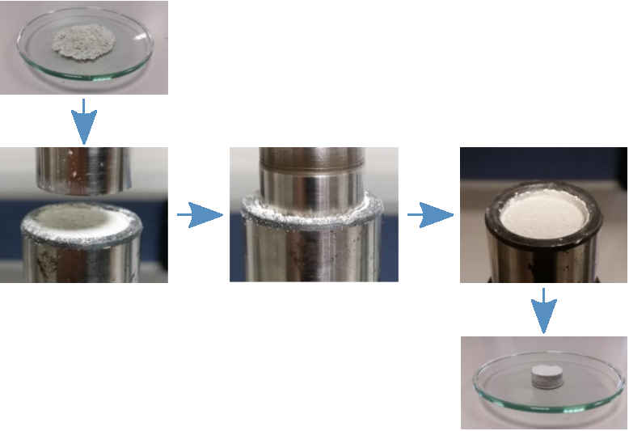

Figura 2: Compresión del material, y sinterizado.

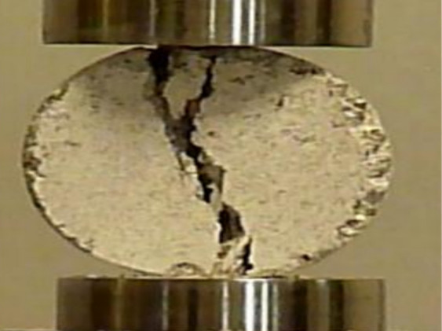

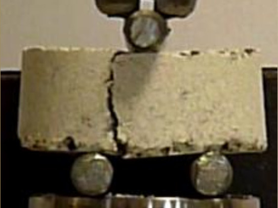

Figura 3: Análisis sobre la probeta: test de compresión (izquierda),
test diametral (medio), y test de flexión (derecha) .

Pero la preparación y análisis manual de las probetas es una tarea larga y laboriosa.
Sería más conveniente simular el proceso para poder automatizarlo. Y si
tomamos las granulometrías empleadas, las fuerzas de compresión y
parámetros de sinterización como variables de diseño, podemos plantear un
problema de optimización donde el objetivo sería minimizar o maximizar
alguna función de evaluación que represente la calidad del refractario
producido.

## **Alcance**

Este trabajo se limita a la simulación del proceso de compresión, evaluación
de algunas propiedades de la probeta producida (densidad, porosidad y permeabilidad),
y proponer una vía para simular la sinterización, como relevo para el siguiente
alumno que continúe con el trabajo como parte de su proyecto de fin de grado o master.

## **Simulación del proceso de compresión**

La mezcla de cerámicas (alúmina y magnesia) estudiada está compuesta por
muchísimas partículas diminutas (empieza a contar cuántos trozitos de café molido
te sirves en la cafetera, y estarás por el mismo orden). Y la idea es simular
el movimiento del conjunto siguiéndole el rastro a todas y cada una de las
partículas, usando la vieja segunda ley de Newton junto con las fuerzas a las
que está sometida cada una. Tan simple que ni siquiera hace gracia, solo es
fuerza bruta. Con todo, es la técnica que proporciona los resultados de mayor
fidelidad, y se conoce como el método de elementos discretos.

La pena es que en el estado de nuestra civilización los ordenadores aún
no son capaces de calcular la trayectoria de miles de millones de puntos
materiales, que interaccionan entre si y con el entorno, sin que nos
hagamos antes polvo.

Así que se hace inevitable hacer simplificaciones:

* En vez de calcular la trayectoria de todas y cada una de las partículas, solo
se consideran las más grandes, y las más pequeñas se desprecian, como
si nunca hubiesen existido. Su influencia en el movimiento y posición
del conjunto se tiene en cuenta a través de unos parámetros de correción,
que deben ajustarse con la información de ensayos experimentales. La idea es
obtener el mismo comportamiento que se tendría en el caso real, con menos
partículas, pero con algunos parámetros cambiados para "dar el pego". Algunos
parámetros de este estilo son: los coeficientes de fricción, coeficientes de
restitución para cada par de interacciones (entre dos tipos de material), fuerzas
o energías de cohesión, incluso módulos de elasticidad.

* Otra simplificación que se suele hacer es considerar las partículas como
esféricas. Sencillamente porque es más rápido comprobar si dos esferas se están
solapando (colisionando), que comprobar si lo hacen dos cuerpos irregulares de
geometría cualquiera. En el caso de que resulte determinante tomar unas
formas lo más parecidas a las reales, una posible estrategia es solapar varias
esferas hasta aproximarse lo suficiente al resultado buscado. Vease la figura 4.

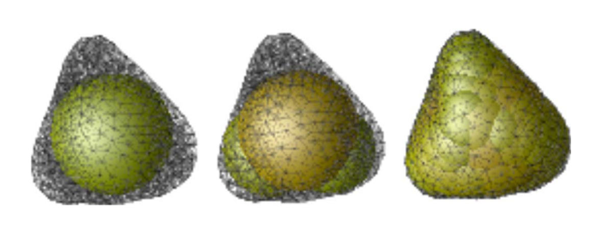

## **Herramientas**

Para implementar el método de elementos discretos, se escogió un código libre:
[LIGGGHTS](http://www.cfdem.com/liggghtsr-open-source-discrete-element-method-particle-simulation-code)(LAMMPS Improved for General Granular and Granular Heat Transfer Simulations).
Con la principal ventaja de tenerlo de forma gratuita. Razón aún más importante
cuando se piensa utilizar un cluster (conjunto de ordenadores interconectados), de otra
forma casi seguro que habría que conseguir una licencia por cada ordenador.

Respecto a su uso, como no tiene interfaz gráfica, toca mirarse los comandos
de la documentación y después montarlos en un script que el programa pueda
entender. El sistema es bastante flexible en el sentido que de que los comandos
te van a permitir hacer practicamente cualquier cosa que quieras, pero a cambio
habrá que echarle tiempo y paciencia.

Típicamente en cualquier simulación se siguen una serie de pasos, con cada uno de
ellos asociado a un conjunto de comandos que pueden o deben usarse, como se muestra en
la figura 5.

En el caso de necesitar dividir una simulación en x etapas, también podría
conectarse la salida de una simulación con la entrada de la siguiente.

Al final, para el caso que toca, que es simular el proceso de compresión,
la cosa quedaría como se ve en la figura 6.

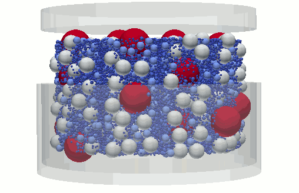

Donde después de comprimir el material, se retira la prensa y después
las paredes de la matriz para comprobar la consistencia del disco (si se
desparramase entonces, la probeta no podría meterse al horno para
sinterizarse, y se descarta).

## **Evaluación de propiedades**

Tras el proceso de compactación, se pide hallar la densidad y porosidad
del disco producido.

La densidad se obtendrá a partír de las masas de las partículas que forman
el disco, y la porosidad ($\epsilon$) se define como la fracción de espacio hueco en el
volumen del disco:

$$\epsilon = \frac{V_{disco} - V_{particulas}}{V_{disco}}$$

En cualquier caso, toca definir cúal es el volumen del disco. Que parece una
cuestión sencilla, pero tiene su miga. Con la vista es trivial identificar la frontera
del material, pero dar un valor al diámetro de ese disco en función únicamente de la
posición de las partículas puede llevar a error si no se tiene cuidado.
Por ejemplo, si se considerase
una frontera que circunscribiese a todas las partículas, una esfera que esté algo
desprendida del resto, puede llevar a que se tome un excesivo espacio hueco, lo que
resultaría en un valor anormalmente alto de la porosidad para el material (figura 7).

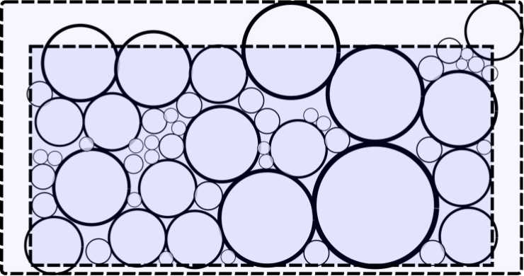

En cambio, parece más razonable tomar un menor diámetro del disco, incluso
metiéndose dentro de la "cama" de partículas, para asegurar que no pase esto.
Entonces surge un nuevo problema: cómo calcular los volúmenes de las partículas
que justo intersectan con la frontera del disco representativo, imaginario que
nos hemos inventado.

Pues pueden hacerse las integrales triples para cada partícula que intersecta
(vease la figura 9), y se tendrán diferentes tipos de integrales para
posiciones relativas entre esfera y frontera, que pueden verse en las
páginas 35-38 del pdf.

Pero otra vía más sencilla de implementar, y que no caí
en ellas hasta después, es integrar por Montecarlo. Que es insertar aleatoriamente
una cantidad de puntos dentro del dominio que interese (en este caso
dentro del disco representativo que se haya tomado), y calcular directamente
la fracción de huecos (porosidad), como la fracción de puntos que ha caido
dentro de espacio hueco ($N_{huecos}$), frente al total de puntos insertados
($N_{introducidos}$).

$$\epsilon = \frac{V_{huecos}}{V_{disco}} = \frac{N_{huecos}}{N_{introducidos}}$$

Si además se subdividiese el dominio del disco en celdas de Voronoi (figura 9), que
cada una ellas bordee una sola partícula, se podrá conocer la porosidad
localmente (a nivel de cada celda de Voronoi), sabiendo qué fracción de
puntos introducidos en la celda de Voronoi, han finalmente caido fuera de
la esfera.

Asociando la porosidad de cada celda con la posición del centro de la
partícula, e interpolando espacialmente entre todos los valores, puede
visualizarse la porosidad local haciendo una especie de
barrido a lo scanner de rayos X, como se muestra en la figura 10.

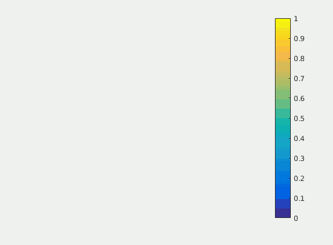

Respecto al cálculo de la permeabilidad, no resultó para nada ser una tarea
sencilla. Las fórmulas analíticas no prometían dar unas estimaciones
razonables para un rango de granulometrías como con el que se necesitaba
trabajar, y por tanto no quedó más alternativa que emplear otra vez
métodos numéricos.

La forma más directa de calcular la permeabilidad sería emplear las ecuaciones
de Navier-Stokes, o de Boltzmann (método de Lattice-Boltzmann), para obtener
el flujo de fluido a través de una sección del disco (perpendicular a la
dirección del flujo), cuando se aplica un gradiente de presiones conocido, a través
de la ley de Darcy, que dice:

$$q = - \frac{k}{\mu} \nabla P $$

donde $q$ es el flujo, $k$ es la permeabilidad absoluta, $\mu$ la
viscosidad dinámica, y $\nabla P$ el gradiente de presiones.

Sin embargo, es una vía muy costosa (bastante más que el propio
análisis de elementos discretos), principalmente debido a que el dominio
que se tendría que utilizar tendría que ser tan grande como aquel que
sea capaz de representar la granulometría de la mezcla. Practicamente
el disco entero con todas sus partículas.

La alternativa más modesta, es emplear un método de redes hidráulicas, donde
se supone que los huecos entre partículas (poros) se unen a través de tubos
de mayor o menor diámetro, por los que se considera que el flujo es laminar.

Conociéndose la conductividad entre los distintos poros, y las condiciones de
contorno (gradiente de presiones entre las caras), puede resolverse la presión
en cada uno de los poros (también llamados nodos). Y luego el flujo entre nodos
con la diferencia de presiones y conductividad. Un ejemplo de una red hidraúlica
de este estilo se ve en la figura 11.

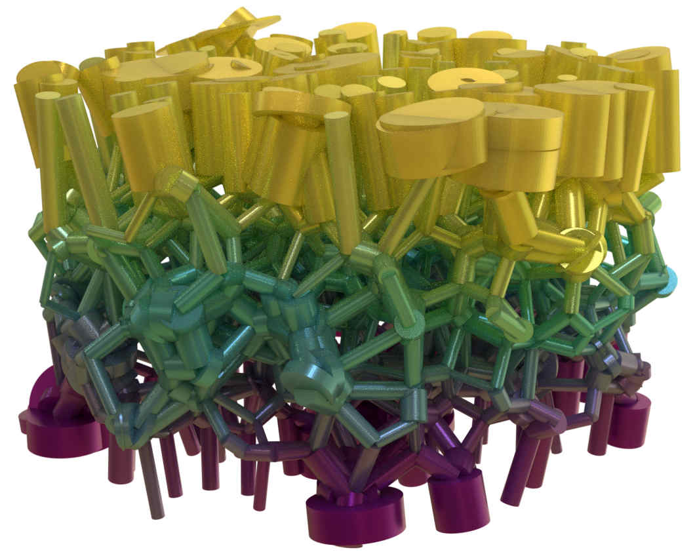

Por desgracia, mi solución en Matlab era más lenta que el caballo del
malo, y apenas podía resolver redes con más de 3000 nodos. Así que
este fue un pequeño fracaso mio intentando calcular la permeabilidad
del disco.

## **Distintas distribuciones granulométricas**

Respecto a la forma que podían tener las granulometrías de las
cerámicas a insertar en la matriz para comprimirse, se tomaron distintas
distribuciones de tamaños:

* Único tamaño posible para cada tipo de partícula (MgO, Al2O3).</li>
* Distribución uniforme.</li>
* Distribución normal.</li>
* Granulometría de una mezcla real, proporcionada por la empresa <em>Insertec</em>.</li>

Para cada una de estas granulometrías subí una [plantilla a github](https://github.com/simulacionRefractarioPFG) sobre la se pueden especificar los parámetros de la distribución. Y después
se calculó para un caso concreto de los parámetros, para mostrar el aspecto
de cada una de las distribuciones (figuras 12-15):

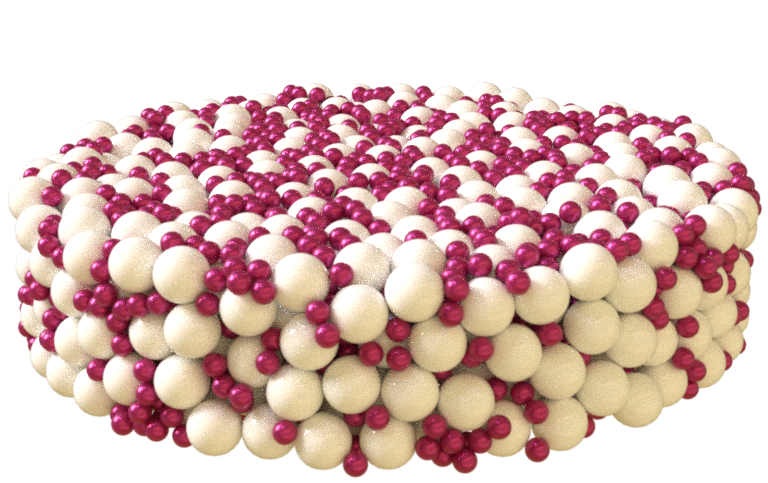

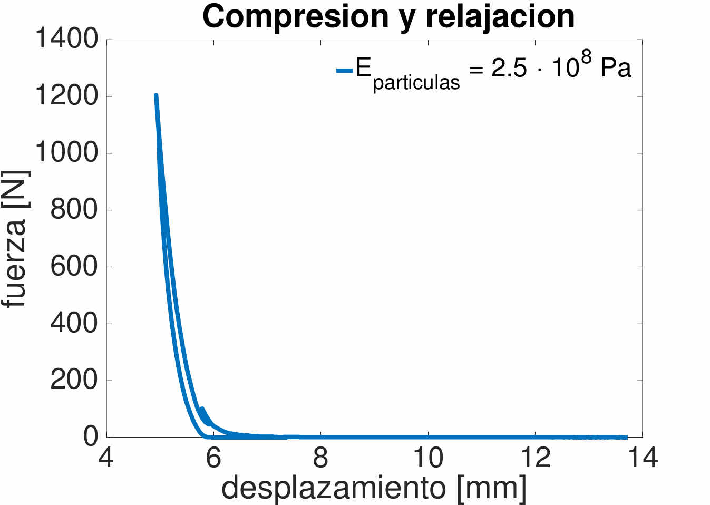

Figura 12: Partículas de magnesia de 700 micras, y de alúmina de 300 micras.

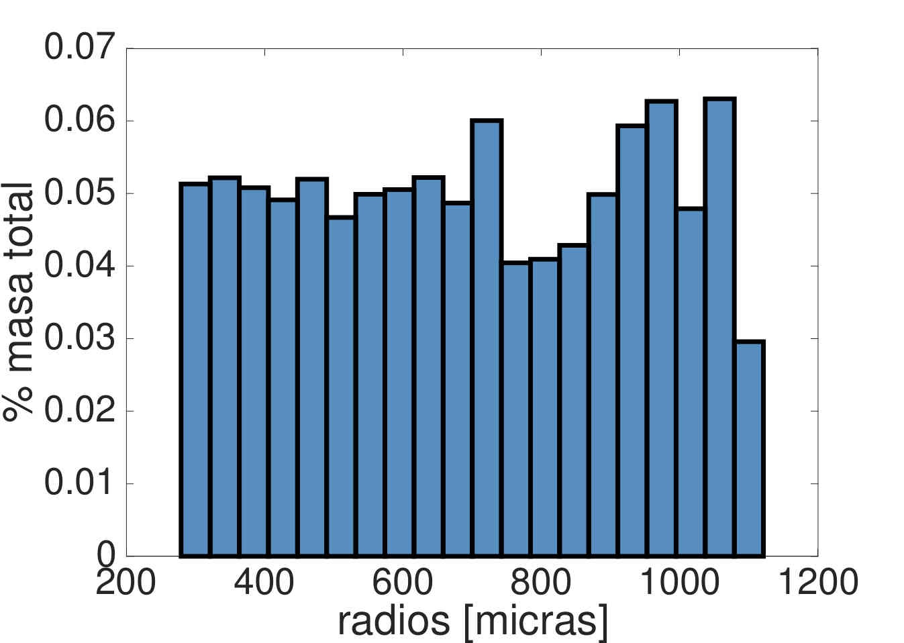

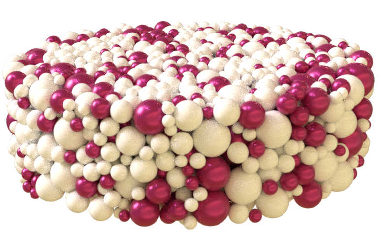

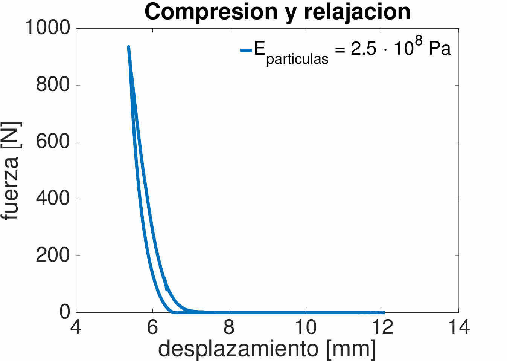

Figura 13: Partículas con distribución uniforme entre 300 y 1100 micras. El 70% de la
masa de la mezcla la forman las partículas de magnesia, el resto de alúmina.

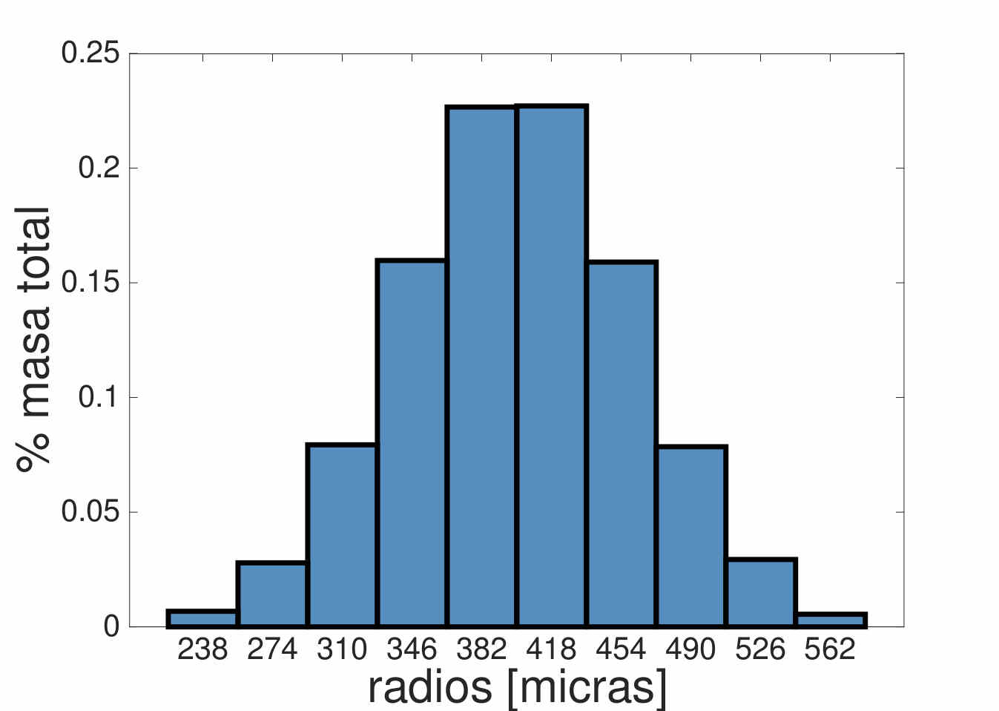

Figura 14: Partículas con distribución normal, tamaño medio de 400 micras,
y desviación típica de 60 micras.

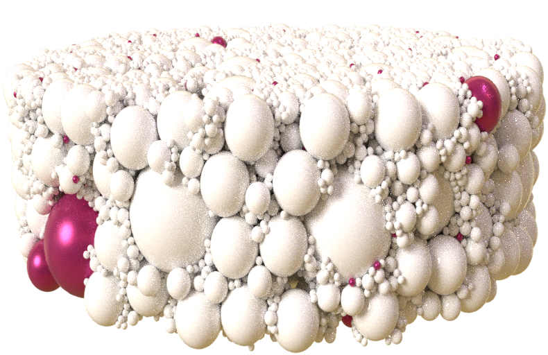

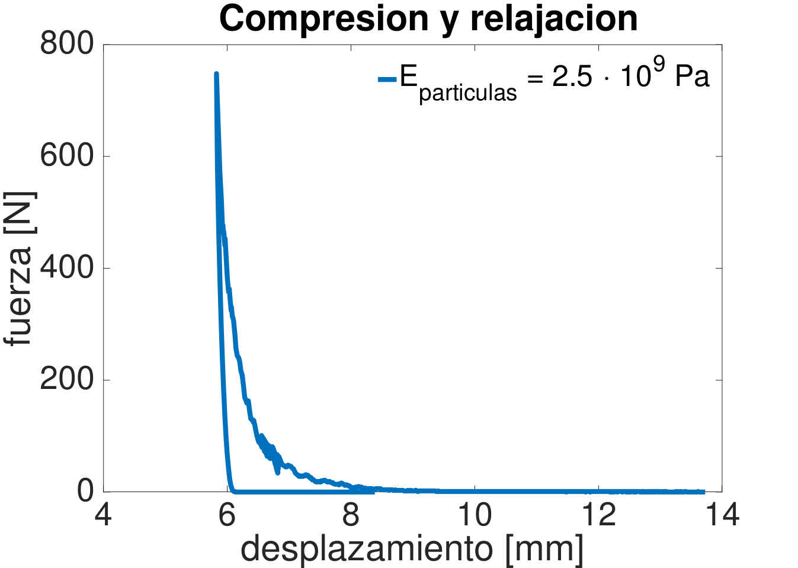

Figura 15: Partículas según la distribución proporcionada por la empresa
<em>Insertec</em>.

